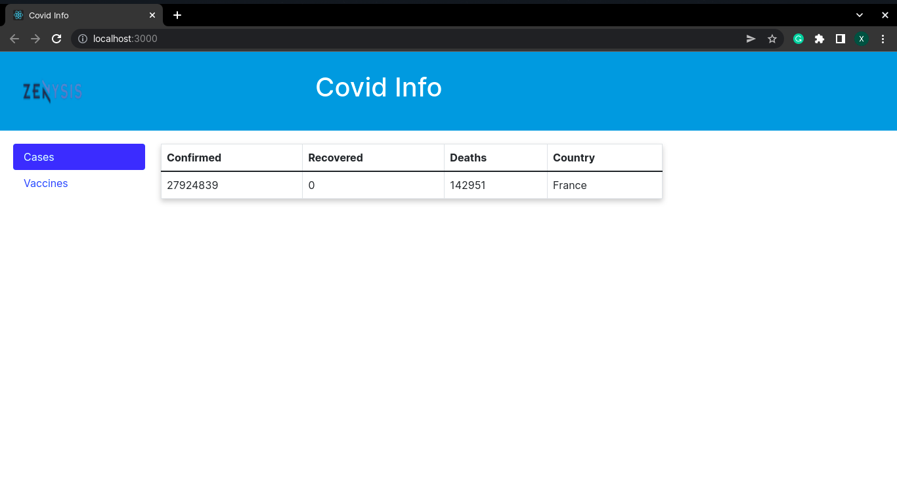
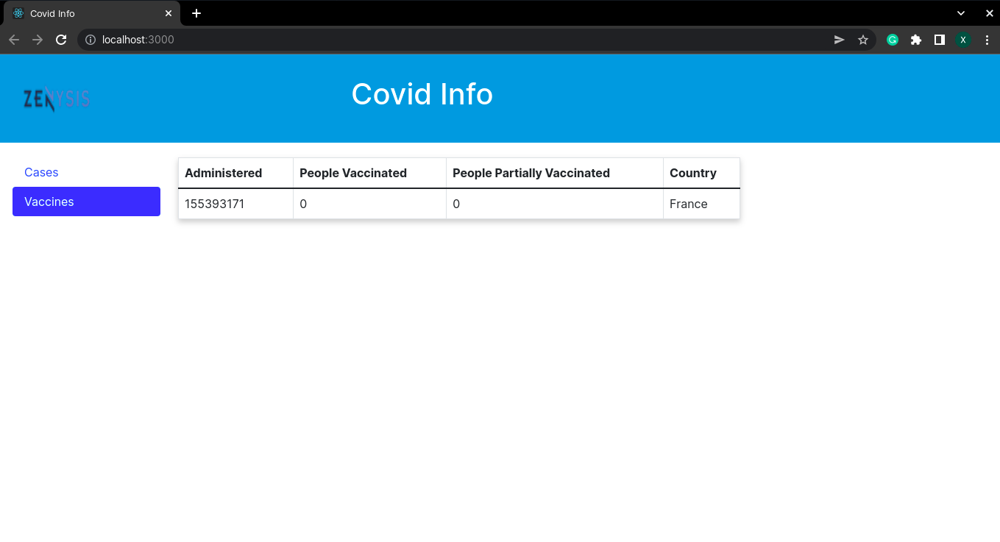

# Zenysis Assessment 

An integration project that uses Flask Python Web Framework to fetch covid info from Media Group API, saves it in the database (Postgres) and then displays it on the frontend (React).

## Overview

- My Approach:
    - So I considered fetching the covid info that is mostly commonly looked at which is cases and vaccines metrics.
    - API endpoints GET /cases and /vaccines fetch this data, store in the database and return it to frontend.
    - I would have liked to make endpoint(s) to fetch all the data on the database and visualize it on a graph on the frontend to show the change in the cases atrributes over time.


## Screenshots





## Run Locally

Clone the project

```bash
$ git clone https://github.com/Singatha/zenysis-assessment.git
```

Go to the backend directory

```bash
$ cd backend
$ python3 -m venv venv
```

Activate virtualenv in macOs/Linux
```bash
$ souce venv/bin/activate
```

Activate virtualenv in Windows
```bash
> souce venv\Scripts\activate
```

Install dependencies

```bash
$ pip install -r requirements.text
$ python app.py
```
Go to the frontend directory

```bash
$ cd ..
$ cd frontend
```

Install dependencies

```bash
npm install
```

Start the application

```bash
npm start
```

## Running Tests

To run tests on backend, activate virtualenv like above and then run

```bash
$ python3 -m unittest tests/tests.py
```

## Lessons Learned

#### What did you learn while building this project?
- React Hooks
- Fetch API
- Flask Web Framework

#### What challenges did you face and how did you overcome them?
- npm version conflict
    - So I wanted to use semantic-ui framework on react, however it conflicted with the latest version of react (v18), I did some googling on how to solve this and the answer was to downgrade react v17, ohhhh it gets better I downgraded to v17 and all hell broke lose (dependency conflicts).
    - So I ended up using react bootstrap.
- setting postgres database with flask
    - here I did some of googling and managed to come right

## Authors

- [@singatha](https://www.github.com/singatha)


## Acknowledgements

 - [Media Group](https://github.com/M-Media-Group/Covid-19-API)
 - [Setting up Flask App official Documentation](https://flask.palletsprojects.com/en/2.1.x/installation/)
 - [React Hooks](https://www.w3schools.com/react/react_hooks.asp)
 - [Fetch API](https://reactjs.org/docs/faq-ajax.html)
